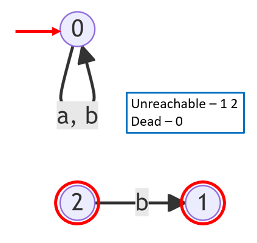
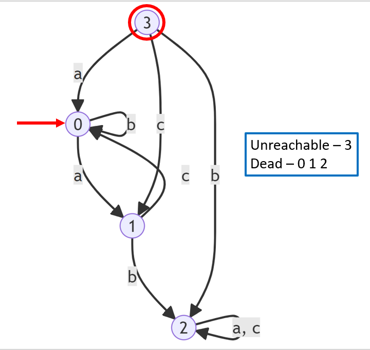
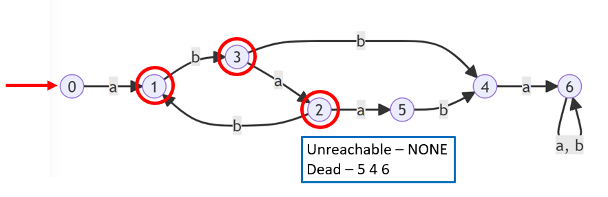

# SystemProgLab2

Ivanov Mykyta, TTP-31.
2 Variant: "Виявити недосяжні та тупикові стани скінченого автомату."

## Правила вводу автомату:

Автомат A на вході програми (та на виході, де потрібно) подається у вигляді текстового файлу наступної структури:

|| A ||                             - Кількість елементів у алфавіті

|| S ||                             - Кількість станів

s_0                                 - Початковий стан

|| F ||                             - Кількість заключнів станів

f_0 f_1 f_2 ... f_n                 - Всі заключні стани

s a s'                              - Все такі трійки, що переводять зі стану s до s' за допомогою a. К-ть будь яка, по одній трійці на рядок до кінця файлу.

Тестові приклади з  поясненням:

### automata1.txt

### automata2.txt

### automata3.txt

